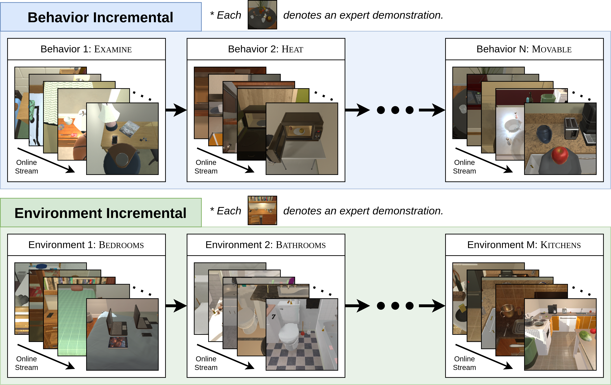

# CL-ALFRED
<a href="https://bhkim94.github.io/projects/CL-ALFRED/"> <b> Online Continual Learning for Interactive Instruction Following Agents </b> </a>
<br>
<a href="https://bhkim94.github.io/">Byeonghwi Kim*</a>,
<a href="https://dbd05088.github.io/">Minhyuk Seo*</a>,
<a href="http://ppolon.github.io/"> Jonghyun Choi </a>
<br>
<a href="https://iclr.cc/"> ICLR 2024 </a>


**CL-ALFRED** is a benchmark that continuously learns new types of behaviors and environments for household tasks in <a href="https://github.com/askforalfred/alfred/tree/master/models">ALFRED</a>.
CL-ALFRED provides two incremental learning setups: **Behavior Incremental Learning** (**Behavior-IL**) to learn novel behaviors (task types) and **Environment Incremental Learning** (**Environment-IL**) to learn to complete tasks in novel environments.

We provide the code of the baselines and CAMA.
The code is built upon <a href="">i-Blurry</a> and <a href="https://github.com/snumprlab/abp">ABP</a>.




## Environment
### Clone repository
```
git clone https://github.com/yonseivnl/cl-alfred.git
cd cl-alfred
export ALFRED_ROOT=$(pwd)
```

### Install requirements
Due to different python version usage for training and evaluation, we need a conda env for each training and evaluation.
```
# Training environment
conda create -n cl-alfred-train python=3.8
conda activate cl-alfred-train
pip install -r requirements_train.txt
```
```
# Evaluation environment
conda create -n cl-alfred-eval python=3.6
conda activate cl-alfred-eval
pip install -r requirements_eval.txt
```

### Install PyTorch
Install PyTorch from <a href="https://pytorch.org/get-started/previous-versions/#v1100">the official PyTorch site</a> for both `cl-alfred-train` and `cl-alfred-eval`.
```
conda deactivate
conda activate cl-alfred-train
pip install torch==1.10.0+cu111 torchvision==0.11.0+cu111 torchaudio==0.10.0 -f https://download.pytorch.org/whl/torch_stable.html

conda deactivate
conda activate cl-alfred-eval
pip install torch==1.10.0+cu111 torchvision==0.11.0+cu111 torchaudio==0.10.0 -f https://download.pytorch.org/whl/torch_stable.html
```


## Dataset Download
### Pre-extracted features
Clone <a href="https://huggingface.co/datasets/byeonghwikim/abp_dataset">the Hugging Face repository</a> to the path `data/json_feat_2.1.0`.
This should include numberized annotation files, ResNet-18 features, the vocabulary file, *etc.*
<br>
```
git clone https://huggingface.co/datasets/byeonghwikim/abp_dataset data/json_feat_2.1.0
```
**Note**: It takes quite a large space (~1.6TB).
**FAQ**: Why does it take so much space? $\rightarrow$ This is because 1) we use [surrounding views](https://bhkim94.github.io/projects/ABP/) (1 $\rightarrow$ 5 views) and 2) we cache all features of these views randomized by [image augmentation used in MOCA](https://bhkim94.github.io/projects/MOCA/) for faster training.

### Raw RGB images, depth masks, and segmentation labels (Optional)
We provide zip files that contain raw RGB images (and depth & segmentation masks) in <a href="https://huggingface.co/datasets/byeonghwikim/abp_images">the Hugging Face repository</a>, which takes about 250GB in total.
With these images, you can extract features yourself with this <a href="https://github.com/snumprlab/abp/blob/main/models/utils/extract_resnet.py">code</a>.
Or, you can build a smaller version of the dataset (*e.g.*, using only egocentric views without surrounding views)!
If you are interested in building the egocentric-only version of this dataset, try <a href="https://github.com/gistvision/moca">MOCA</a> for an egocentric-view model!


## Training
First, activate the training environment `cl-alfred-train`.
```
conda deactivate
conda activate cl-alfred-train
```

To train a model, run `train_seq2seq.py` with the hyper-parameters below. <br>
- `incremental_setup`: `behavior_il` (Behavior-IL) or `environment_il` (Environment-IL)
- `mode`: Continual learning methods
  - `cama`: Confidence-Aware Moving Average
  - `cama_nodc`: CAMA without Dynamically Determined Coefficients (CAMA w/o DC)
  - `xder` eXtended-DER (Boschini et al. IEEE TPAMI'22)
  - `der`: Dark Experience Replay (Buzzega et al. NeurIPS'20)
  - `clib`: Continual Learning for i-Blurry (Koh et al. ICLR'22)
  - `mir`: Maximally Interfered Retrieval (Aljundi et al. NeurIPS'19)
  - `er`: Experience Replay (Rolnick et al. NeurIPS'19)
  - `ewc++`: Elastic (Kirkpatrick et al. PNAS'17)
- `stream_seed`: random seed for a behavior/environment sequence
- `dout`: a path to save a model in
```
python models/train/train_seq2seq.py        \
    --incremental_setup <incremental_setup> \
    --mode <mode>                           \
    --stream_seed <stream_seed>             \
    --dout <path_to_save_weight>
```
**Note**: All hyperparameters used for the experiments in the paper are set as default.

For example, if you want train `CAMA` for the `Behavior-IL` setup with a stream seed `1` and save the weights in `exp/behavior_il/cama/s1`, the command may look like below.
```
python models/train/train_seq2seq.py        \
    --incremental_setup behavior_il         \
    --mode cama                             \
    --stream_seed 1                         \
    --dout exp/behavior_il/cama/s1
```

## Evaluation
First, activate the evaluation environment `cl-alfred-eval`.
```
conda deactivate
conda activate cl-alfred-eval
```

To evaluate a model, run `eval_seq2seq.py` with the hyper-parameters below. <br>
- `model_path`: the path of a saved model
- `eval_split`: `valid_seen` (Valid Seen) or `valid_unseen` (Valid Unseen)
- `x_display`: the number of your display (check `echo $DISPLAY` in your command)
- `incremental_setup`: `behavior_il` (Behavior-IL) or `environment_il` (Environment-IL)
- `incremental_type`: the current incremental type learned
  - Behavior-IL: `look_at_obj_in_light`, `pick_heat_then_place_in_recep`, `pick_two_obj_and_place`, `pick_cool_then_place_in_recep`, `pick_and_place_simple`, `pick_clean_then_place_in_recep`, `pick_and_place_with_movable_recep`
  - Environment-IL: `Kitchen`, `Livingroom`, `Bedroom`, `Bathroom`
- `stream_seed`: the seed number of a random stream (`1`, `2`, `3`, `4`, and `5`)
- `num_threads`: the number of simulators used for evaluation
- `gpu`: the usage of GPU during evaluation
```
python models/eval/eval_seq2seq.py --gpu      \
    --model_path <model_path>                 \
    --eval_split <eval_split>                 \
    --incremental_setup <incremental_setup>   \
    --num_threads <num_threads>               \
    --x_display <x_display>                   \
    --gpu
```
**Note**: All hyperparameters used for the experiments in the paper are set as default.<br>
**Note**: For cpu-only evaluation, remove the option `--gpu`.

If you want to evaluate our model saved in `exp/behavior_il/cama/s1/net_epoch_000002251_look_at_obj_in_light.pth` in the `seen` validation for the current task `look_at_obj_in_light` of the `Behavior-IL` setup trained with a random stream sequence `1`, you may use the command below.
```
python models/eval/eval_seq2seq.py                                                    \
    --model_path exp/behavior_il/cama/s1/net_epoch_000002251_look_at_obj_in_light.pth \
    --eval_split valid_seen                                                           \
    --incremental_setup behavior_il                                                   \
    --incremental_type look_at_obj_in_light                                           \
    --stream_seed 1                                                                   \
    --num_threads 3                                                                   \
    --x_display 1                                                                     \
    --gpu
```
**Note**: Choose your available display number `x_display`.<br>
**Note**: Adjust your thread number based on your system `num_threads`.


## Hardware
Trained and tested on:
- **GPU** - NVIDIA RTX A6000 (48GB)
- **CUDA** - CUDA 12.0
- **CPU** - 12th Gen Intel(R) Core(TM) i7-12700K
- **RAM** - 64GB
- **OS** - Ubuntu 20.04


## License
GNU GENERAL PUBLIC LICENSE


## Citation
**CL-ALFRED**
```
@inproceedings{kim2024online,
  title={Online Continual Learning for Interactive Instruction Following Agents},
  author={Kim, Byeonghwi and Seo, Minhyuk and Choi, Jonghyun},
  booktitle={ICLR},
  year={2024}
}
```
**i-Blurry**
```
@inproceedings{koh2022online,
  title={Online Continual Learning on Class Incremental Blurry Task Configuration with Anytime Inference},
  author={Koh, Hyunseo and Kim, Dahyun and Ha, Jung-Woo and Choi, Jonghyun},
  booktitle={ICLR},
  year={2022}
}
```
**ABP**
```
@inproceedings{kim2021agent,
  author    = {Kim, Byeonghwi and Bhambri, Suvaansh and Singh, Kunal Pratap and Mottaghi, Roozbeh and Choi, Jonghyun},
  title     = {Agent with the Big Picture: Perceiving Surroundings for Interactive Instruction Following},
  booktitle = {Embodied AI Workshop @ CVPR 2021},
  year      = {2021},
}
```
**ALFRED**
```
@inproceedings{ALFRED20,
  title ={{ALFRED: A Benchmark for Interpreting Grounded
           Instructions for Everyday Tasks}},
  author={Mohit Shridhar and Jesse Thomason and Daniel Gordon and Yonatan Bisk and
          Winson Han and Roozbeh Mottaghi and Luke Zettlemoyer and Dieter Fox},
  booktitle = {The IEEE Conference on Computer Vision and Pattern Recognition (CVPR)},
  year = {2020},
  url  = {https://arxiv.org/abs/1912.01734}
}
```

## Acknowlegment
```
This work was partly supported by the NRF grant (No.2022R1A2C4002300, 15%) and IITP grants (No.2020-0-01361 (10%, Yonsei AI), No.2021-0-01343 (5%, SNU AI), No.2022-0-00077 (10%), No.2022-0-00113 (20%), No.2022-0-00959 (15%), No.2022-0-00871 (15%), No.2021-0-02068 (5%, AI Innov. Hub), No.2022-0-00951 (5%)) funded by the Korea government (MSIT).
```
